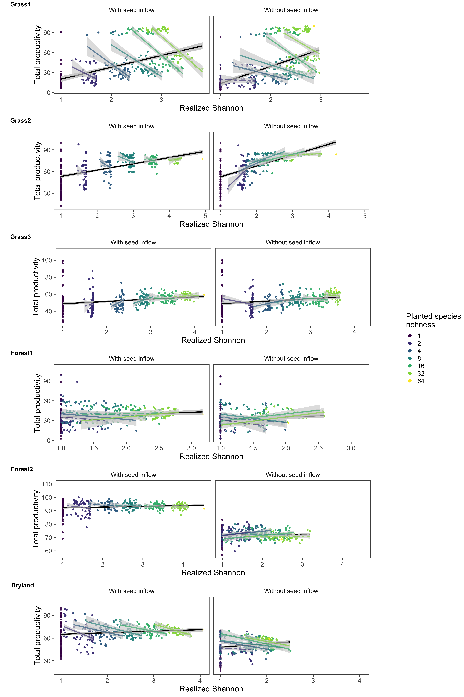
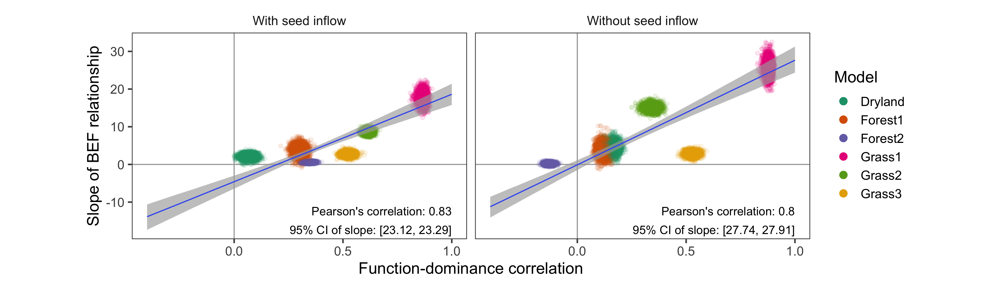
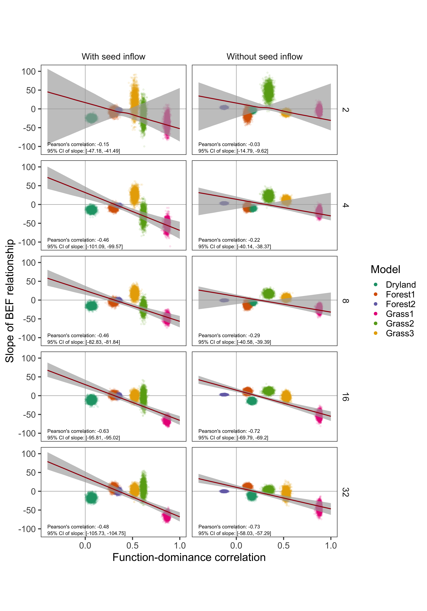

<style>
pre 
{
    overflow-x: auto;
}
pre code 
{
    word-wrap: normal;
    white-space: pre;
}
</style>

```{r setup-knitr, include = FALSE}

options(width = 1000)

library(knitr)
knitr::opts_chunk$set(echo = FALSE,
                      warning = FALSE,
                      message = FALSE,
                      size = "small",
                      dev = "png") 

```

In addition to conducting our analysis with biomass as the measurement of ecosystem function, in this document we report our results using net primary productivity (NPP).

Mirroring the manuscript's central analysis, our models for the across-treatment effect were encoded as: `Productivity ~ -1 + Stage + Stage:Shannon`, and the within-treatment effect was encoded as: `Productivity ~ -1 + Richness:Stage + Richness:Stage:Shannon`. All models successfully converged, with Rhat values of `1.0`, and posterior predictive checks (PPC) were used to visually validate the model fits.


****************************************************************************************************
# Figure 2 - Counter-gradient

```{r fig-2, out.width = "800px"}



```

The relationship between Shannon diversity and productivity was qualitatively similar to that of Shannon diversity for the majority of the models (4/6). 

In Forest2, while the within-treatment slopes are consistent between biomass and productivity, the across-treatment slopes differ. During the `with` stage, the across-treatment slope is insignificant with biomass, but significant and slightly positive for productivity. During the `without seed inflow` phase, the significant and negative across-treatment slope of the relationship between biomass and Shannon diversity becomes insignificant for productivity.

Dryland displays the most variation between the two measures of ecosystem functioning. The predominant difference is shows in the within-treatment slopes, as they flip from being significantly positive to significantly negative in both the `with` and `without seed inflow` phases. Secondly, while the across-treatment slope is insignificant during the `without seed inflow` phase for biomass as the ecosystem functioning, for productivity the slope is significant and positive. The reason for this change is clerical, because while seed biomass is incorporated into the productivity calculations, it is left absent from the total biomass calculations.


****************************************************************************************************
# Figure 3 - Across-treatment effect

```{r fig-3, out.width = "800px"}



```

Considering the relationship between our measure of the internal coexistence processes within each model and the across-treatment effect of realized diversity on the focal ecosystem function (either productivity or biomass), we find that the aggregate patterns are nearly identical between ecosystem functions. 


****************************************************************************************************
# Figure 4 - Within-treatment effect

```{r fig-4, out.width = "800px"}



```

Considering the relationship between our measure of the internal coexistence processes within each model and the within-treatment effect of realized diversity on the focal ecosystem function (either productivity or biomass), we find that the aggregate patterns are nearly identical between ecosystem functions. 


****************************************************************************************************
# Model validation

```{r setup, include=FALSE}

library(tidyverse)
library(knitr)
library(rstan)
library(brms)
library(tidybayes)
library(modelr)
library(sjstats)
library(sjPlot)

setwd(dirname(rstudioapi::getActiveDocumentContext()$path))
setwd("../data/brms_models")

models <- readRDS(file = "productivity_brms_models.rds") %>% 
    filter(measure == "Shannon")

```

This section of the document describes the statistical models' validation, using **Shannon diversity** as the focal biodiversity metric and **productivity** as the focal ecosystem function.

Important terms:

* `Stage`: With seed inflow, without seed inflow
* `Ninitial`: Planted species richness


****************************************************************************************************
## Grass1

Clark, A. T., C. Lehman, and D. Tilman. 2018. Identifying mechanisms that structure ecological communities by snapping model parameters to empirically observed trade-offs. Ecology Letters 21:494–505.

```{r Grass1-setup, include=FALSE}

Grass1 <- models %>% filter(Model == "Grass1") %>% unlist(recursive = FALSE)

```

### Across-treatment effect

A summary table of the BRMS model results:
```{r Grass1-across-treatment-effect}

Grass1$acrossEffect

```
> Note the `Rhat` summary column: variation from 1.0 indicates the the model did not converge.

The Bayesian R-squared:
```{r Grass1-across-treatment-effect-R2}

rstantools::bayes_R2(Grass1$acrossEffect)

```

****************************************************************************************************
#### Posterior predictive checks

We next use posterior predictive checks (PPC) to judge the fit of the model. These compare the real data to the posterior distribution, conditioned on the observed data.

##### Density plot
The density of both the real data (`y`, black line), and from fitted draws of the models (`y_rep`, blue lines).
```{r Grass1-across-treatment-PPC-PDF}

brms::pp_check(Grass1$acrossEffect) +
    labs(x = "Total biomass") +
    theme_bw() 

```

##### Scatter plot
Average prediction (`y_rep`) for each real data point (`y`). A line indicates a 1:1 correspondence for reference.
```{r Grass1-across-treatment-scatter-avg}

brms::pp_check(Grass1$acrossEffect,
               type = 'scatter_avg_grouped',
               group = "Stage") +
    geom_abline(intercept = 0,
                slope = 1) +
    labs(title = "Realized total biomass to average predicted total biomass") +
    theme_bw()

```

##### Highest-density interval
Highest-density interval (HDI) for each effect within the model. This characterizes the uncertainty of our posterior distributions. Highest-density intervals can be thought of as credibility intervals (see [here](https://mathematica.stackexchange.com/questions/173282/computing-credible-region-highest-posterior-density-from-empirical-distributio)). We use the 89% HDI as recommended by Kruschke (2014), see [here](https://easystats.github.io/bayestestR/reference/hdi.html) for more information.
```{r Grass1-across-treatment-HDI}

sjPlot::plot_model(Grass1$acrossEffect,
                   title = "89% Highest-density intervals")

```

****************************************************************************************************
### Within-treatment effect

A summary table of the BRMS model results:
```{r Grass1-within-treatment-effect-display}

Grass1$withinEffect

```
> Note the `Rhat` summary column: variation from 1.0 indicates the the model did not converge.

The Bayesian R-squared:
```{r Grass1-within-treatment-effect-R2}

rstantools::bayes_R2(Grass1$withinEffect)

```

****************************************************************************************************
#### Posterior predictive checks

##### Density plot

The density of both the real data (`y`, black line), and from fitted draws of the models (`y_rep`, blue lines).
```{r Grass1-within-treatment-effect-PPC-PDF}

brms::pp_check(Grass1$withinEffect) +
    labs(x = "Total biomass") +
    theme_bw()

```

##### Scatter plot

Average prediction (`y_rep`) for each real data point (`y`), grouping the comparison of `y` to `y_rep` by `Ninitial`. A line indicates a 1:1 correspondence for reference.
```{r Grass1-within-treatment-effect-PPC-scatter-avg}

brms::pp_check(Grass1$withinEffect,
               type = 'scatter_avg_grouped',
               group = "Ninitial") +
    geom_abline(intercept = 0,
                slope = 1) +
    labs(title = "Realized total biomass to average predicted total biomass") +
    theme_bw()

```

##### Highest-density interval

Highest-density interval (HDI) for each effect within the model. This characterizes the uncertainty of our posterior distributions. Highest-density intervals can be thought of as credibility intervals (see [here](https://mathematica.stackexchange.com/questions/173282/computing-credible-region-highest-posterior-density-from-empirical-distributio)). We use the 89% HDI as recommended by Kruschke (2014), see [here](https://easystats.github.io/bayestestR/reference/hdi.html) for more information.
```{r Grass1-within-treatment-effect-HDI}

sjPlot::plot_model(Grass1$withinEffect,
                   title = "89% Highest-density intervals")

```

****************************************************************************************************
## Grass2

Turnbull, L. A., J. M. Levine, M. Loreau, and A. Hector. 2013. Coexistence, niches and biodiversity effects on ecosystem functioning. Ecology Letters 16:116–127.

```{r Grass2-setup, include=FALSE}

Grass2 <- models %>% filter(Model == "Grass2") %>% unlist(recursive = FALSE)

```

### Across-treatment effect

A summary table of the BRMS model results:
```{r Grass2-across-treatment-effect}

Grass2$acrossEffect

```
> Note the `Rhat` summary column: variation from 1.0 indicates the the model did not converge.

The Bayesian R-squared:
```{r Grass2-across-treatment-effect-R2}

rstantools::bayes_R2(Grass2$acrossEffect)

```

****************************************************************************************************
#### Posterior predictive checks

We next use posterior predictive checks (PPC) to judge the fit of the model. These compare the real data to the posterior distribution, conditioned on the observed data.

##### Density plot
The density of both the real data (`y`, black line), and from fitted draws of the models (`y_rep`, blue lines).
```{r Grass2-across-treatment-PPC-PDF}

brms::pp_check(Grass2$acrossEffect) +
    labs(x = "Total biomass") +
    theme_bw() 

```

##### Scatter plot
Average prediction (`y_rep`) for each real data point (`y`). A line indicates a 1:1 correspondence for reference.
```{r Grass2-across-treatment-scatter-avg}

brms::pp_check(Grass2$acrossEffect,
               type = 'scatter_avg_grouped',
               group = "Stage") +
    geom_abline(intercept = 0,
                slope = 1) +
    labs(title = "Realized total biomass to average predicted total biomass") +
    theme_bw()

```

##### Highest-density interval
Highest-density interval (HDI) for each effect within the model. This characterizes the uncertainty of our posterior distributions. Highest-density intervals can be thought of as credibility intervals (see [here](https://mathematica.stackexchange.com/questions/173282/computing-credible-region-highest-posterior-density-from-empirical-distributio)). We use the 89% HDI as recommended by Kruschke (2014), see [here](https://easystats.github.io/bayestestR/reference/hdi.html) for more information.
```{r Grass2-across-treatment-HDI}

sjPlot::plot_model(Grass2$acrossEffect,
                   title = "89% Highest-density intervals")

```

****************************************************************************************************
### Within-treatment effect

A summary table of the BRMS model results:
```{r Grass2-within-treatment-effect-display}

Grass2$withinEffect

```
> Note the `Rhat` summary column: variation from 1.0 indicates the the model did not converge.

The Bayesian R-squared:
```{r Grass2-within-treatment-effect-R2}

rstantools::bayes_R2(Grass2$withinEffect)

```

****************************************************************************************************
#### Posterior predictive checks

##### Density plot

The density of both the real data (`y`, black line), and from fitted draws of the models (`y_rep`, blue lines).
```{r Grass2-within-treatment-effect-PPC-PDF}

brms::pp_check(Grass2$withinEffect) +
    labs(x = "Total biomass") +
    theme_bw()

```

##### Scatter plot

Average prediction (`y_rep`) for each real data point (`y`), grouping the comparison of `y` to `y_rep` by `Ninitial`. A line indicates a 1:1 correspondence for reference.
```{r Grass2-within-treatment-effect-PPC-scatter-avg}

brms::pp_check(Grass2$withinEffect,
               type = 'scatter_avg_grouped',
               group = "Ninitial") +
    geom_abline(intercept = 0,
                slope = 1) +
    labs(title = "Realized total biomass to average predicted total biomass") +
    theme_bw()

```

##### Highest-density interval

Highest-density interval (HDI) for each effect within the model. This characterizes the uncertainty of our posterior distributions. Highest-density intervals can be thought of as credibility intervals (see [here](https://mathematica.stackexchange.com/questions/173282/computing-credible-region-highest-posterior-density-from-empirical-distributio)). We use the 89% HDI as recommended by Kruschke (2014), see [here](https://easystats.github.io/bayestestR/reference/hdi.html) for more information.
```{r Grass2-within-treatment-effect-HDI}

sjPlot::plot_model(Grass2$withinEffect,
                   title = "89% Highest-density intervals")

```

****************************************************************************************************
## Grass3

May, F., V. Grimm, and F. Jeltsch. 2009. Reversed effects of grazing on plant diversity: The role of below-ground competition and size symmetry. Oikos 118:1830–1843.

```{r Grass3-setup, include=FALSE}

Grass3 <- models %>% filter(Model == "Grass3") %>% unlist(recursive = FALSE)

```

### Across-treatment effect

A summary table of the BRMS model results:
```{r Grass3-across-treatment-effect}

Grass3$acrossEffect

```
> Note the `Rhat` summary column: variation from 1.0 indicates the the model did not converge.

The Bayesian R-squared:
```{r Grass3-across-treatment-effect-R2}

rstantools::bayes_R2(Grass3$acrossEffect)

```

****************************************************************************************************
#### Posterior predictive checks

We next use posterior predictive checks (PPC) to judge the fit of the model. These compare the real data to the posterior distribution, conditioned on the observed data.

##### Density plot
The density of both the real data (`y`, black line), and from fitted draws of the models (`y_rep`, blue lines).
```{r Grass3-across-treatment-PPC-PDF}

brms::pp_check(Grass3$acrossEffect) +
    labs(x = "Total biomass") +
    theme_bw() 

```

##### Scatter plot
Average prediction (`y_rep`) for each real data point (`y`). A line indicates a 1:1 correspondence for reference.
```{r Grass3-across-treatment-scatter-avg}

brms::pp_check(Grass3$acrossEffect,
               type = 'scatter_avg_grouped',
               group = "Stage") +
    geom_abline(intercept = 0,
                slope = 1) +
    labs(title = "Realized total biomass to average predicted total biomass") +
    theme_bw()

```

##### Highest-density interval
Highest-density interval (HDI) for each effect within the model. This characterizes the uncertainty of our posterior distributions. Highest-density intervals can be thought of as credibility intervals (see [here](https://mathematica.stackexchange.com/questions/173282/computing-credible-region-highest-posterior-density-from-empirical-distributio)). We use the 89% HDI as recommended by Kruschke (2014), see [here](https://easystats.github.io/bayestestR/reference/hdi.html) for more information.
```{r Grass3-across-treatment-HDI}

sjPlot::plot_model(Grass3$acrossEffect,
                   title = "89% Highest-density intervals")

```

****************************************************************************************************
### Within-treatment effect

A summary table of the BRMS model results:
```{r Grass3-within-treatment-effect-display}

Grass3$withinEffect

```
> Note the `Rhat` summary column: variation from 1.0 indicates the the model did not converge.

The Bayesian R-squared:
```{r Grass3-within-treatment-effect-R2}

rstantools::bayes_R2(Grass3$withinEffect)

```

****************************************************************************************************
#### Posterior predictive checks

##### Density plot

The density of both the real data (`y`, black line), and from fitted draws of the models (`y_rep`, blue lines).
```{r Grass3-within-treatment-effect-PPC-PDF}

brms::pp_check(Grass3$withinEffect) +
    labs(x = "Total biomass") +
    theme_bw()

```

##### Scatter plot

Average prediction (`y_rep`) for each real data point (`y`), grouping the comparison of `y` to `y_rep` by `Ninitial`. A line indicates a 1:1 correspondence for reference.
```{r Grass3-within-treatment-effect-PPC-scatter-avg}

brms::pp_check(Grass3$withinEffect,
               type = 'scatter_avg_grouped',
               group = "Ninitial") +
    geom_abline(intercept = 0,
                slope = 1) +
    labs(title = "Realized total biomass to average predicted total biomass") +
    theme_bw()

```

##### Highest-density interval

Highest-density interval (HDI) for each effect within the model. This characterizes the uncertainty of our posterior distributions. Highest-density intervals can be thought of as credibility intervals (see [here](https://mathematica.stackexchange.com/questions/173282/computing-credible-region-highest-posterior-density-from-empirical-distributio)). We use the 89% HDI as recommended by Kruschke (2014), see [here](https://easystats.github.io/bayestestR/reference/hdi.html) for more information.
```{r Grass3-within-treatment-effect-HDI}

sjPlot::plot_model(Grass3$withinEffect,
                   title = "89% Highest-density intervals")

```


****************************************************************************************************
## Forest1

Rüger, N., R. Condit, D. H. Dent, S. J. DeWalt, S. P. Hubbell, J. W. Lichstein, O. R. Lopez, C. Wirth, and C. E. Farrior. 2020. Demographic trade-offs predict tropical forest dynamics. Science 368:165–168.

```{r Forest1-setup, include=FALSE}

Forest1 <- models %>% filter(Model == "Forest1") %>% unlist(recursive = FALSE)

```

### Across-treatment effect

A summary table of the BRMS model results:
```{r Forest1-across-treatment-effect}

Forest1$acrossEffect

```
> Note the `Rhat` summary column: variation from 1.0 indicates the the model did not converge.

The Bayesian R-squared:
```{r Forest1-across-treatment-effect-R2}

rstantools::bayes_R2(Forest1$acrossEffect)

```

****************************************************************************************************
#### Posterior predictive checks

We next use posterior predictive checks (PPC) to judge the fit of the model. These compare the real data to the posterior distribution, conditioned on the observed data.

##### Density plot
The density of both the real data (`y`, black line), and from fitted draws of the models (`y_rep`, blue lines).
```{r Forest1-across-treatment-PPC-PDF}

brms::pp_check(Forest1$acrossEffect) +
    labs(x = "Total biomass") +
    theme_bw() 

```

##### Scatter plot
Average prediction (`y_rep`) for each real data point (`y`). A line indicates a 1:1 correspondence for reference.
```{r Forest1-across-treatment-scatter-avg}

brms::pp_check(Forest1$acrossEffect,
               type = 'scatter_avg_grouped',
               group = "Stage") +
    geom_abline(intercept = 0,
                slope = 1) +
    labs(title = "Realized total biomass to average predicted total biomass") +
    theme_bw()

```

##### Highest-density interval
Highest-density interval (HDI) for each effect within the model. This characterizes the uncertainty of our posterior distributions. Highest-density intervals can be thought of as credibility intervals (see [here](https://mathematica.stackexchange.com/questions/173282/computing-credible-region-highest-posterior-density-from-empirical-distributio)). We use the 89% HDI as recommended by Kruschke (2014), see [here](https://easystats.github.io/bayestestR/reference/hdi.html) for more information.
```{r Forest1-across-treatment-HDI}

sjPlot::plot_model(Forest1$acrossEffect,
                   title = "89% Highest-density intervals")

```

****************************************************************************************************
### Within-treatment effect

A summary table of the BRMS model results:
```{r Forest1-within-treatment-effect-display}

Forest1$withinEffect

```
> Note the `Rhat` summary column: variation from 1.0 indicates the the model did not converge.

The Bayesian R-squared:
```{r Forest1-within-treatment-effect-R2}

rstantools::bayes_R2(Forest1$withinEffect)

```

****************************************************************************************************
#### Posterior predictive checks

##### Density plot

The density of both the real data (`y`, black line), and from fitted draws of the models (`y_rep`, blue lines).
```{r Forest1-within-treatment-effect-PPC-PDF}

brms::pp_check(Forest1$withinEffect) +
    labs(x = "Total biomass") +
    theme_bw()

```

##### Scatter plot

Average prediction (`y_rep`) for each real data point (`y`), grouping the comparison of `y` to `y_rep` by `Ninitial`. A line indicates a 1:1 correspondence for reference.
```{r Forest1-within-treatment-effect-PPC-scatter-avg}

brms::pp_check(Forest1$withinEffect,
               type = 'scatter_avg_grouped',
               group = "Ninitial") +
    geom_abline(intercept = 0,
                slope = 1) +
    labs(title = "Realized total biomass to average predicted total biomass") +
    theme_bw()

```

##### Highest-density interval

Highest-density interval (HDI) for each effect within the model. This characterizes the uncertainty of our posterior distributions. Highest-density intervals can be thought of as credibility intervals (see [here](https://mathematica.stackexchange.com/questions/173282/computing-credible-region-highest-posterior-density-from-empirical-distributio)). We use the 89% HDI as recommended by Kruschke (2014), see [here](https://easystats.github.io/bayestestR/reference/hdi.html) for more information.
```{r Forest1-within-treatment-effect-HDI}

sjPlot::plot_model(Forest1$withinEffect,
                   title = "89% Highest-density intervals")

```


****************************************************************************************************
## Forest2

Maréchaux, I., and J. Chave. 2017. An individual-based forest model to jointly simulate carbon and tree diversity in Amazonia: description and applications. Ecological Monographs.

```{r Forest2-setup, include=FALSE}

Forest2 <- models %>% filter(Model == "Forest2") %>% unlist(recursive = FALSE)

```

### Across-treatment effect

A summary table of the BRMS model results:
```{r Forest2-across-treatment-effect}

Forest2$acrossEffect

```
> Note the `Rhat` summary column: variation from 1.0 indicates the the model did not converge.

The Bayesian R-squared:
```{r Forest2-across-treatment-effect-R2}

rstantools::bayes_R2(Forest2$acrossEffect)

```

****************************************************************************************************
#### Posterior predictive checks

We next use posterior predictive checks (PPC) to judge the fit of the model. These compare the real data to the posterior distribution, conditioned on the observed data.

##### Density plot
The density of both the real data (`y`, black line), and from fitted draws of the models (`y_rep`, blue lines).
```{r Forest2-across-treatment-PPC-PDF}

brms::pp_check(Forest2$acrossEffect) +
    labs(x = "Total biomass") +
    theme_bw() 

```

##### Scatter plot
Average prediction (`y_rep`) for each real data point (`y`). A line indicates a 1:1 correspondence for reference.
```{r Forest2-across-treatment-scatter-avg}

brms::pp_check(Forest2$acrossEffect,
               type = 'scatter_avg_grouped',
               group = "Stage") +
    geom_abline(intercept = 0,
                slope = 1) +
    labs(title = "Realized total biomass to average predicted total biomass") +
    theme_bw()

```

##### Highest-density interval
Highest-density interval (HDI) for each effect within the model. This characterizes the uncertainty of our posterior distributions. Highest-density intervals can be thought of as credibility intervals (see [here](https://mathematica.stackexchange.com/questions/173282/computing-credible-region-highest-posterior-density-from-empirical-distributio)). We use the 89% HDI as recommended by Kruschke (2014), see [here](https://easystats.github.io/bayestestR/reference/hdi.html) for more information.
```{r Forest2-across-treatment-HDI}

sjPlot::plot_model(Forest2$acrossEffect,
                   title = "89% Highest-density intervals")

```

****************************************************************************************************
### Within-treatment effect

A summary table of the BRMS model results:
```{r Forest2-within-treatment-effect-display}

Forest2$withinEffect

```
> Note the `Rhat` summary column: variation from 1.0 indicates the the model did not converge.

The Bayesian R-squared:
```{r Forest2-within-treatment-effect-R2}

rstantools::bayes_R2(Forest2$withinEffect)

```

****************************************************************************************************
#### Posterior predictive checks

##### Density plot

The density of both the real data (`y`, black line), and from fitted draws of the models (`y_rep`, blue lines).
```{r Forest2-within-treatment-effect-PPC-PDF}

brms::pp_check(Forest2$withinEffect) +
    labs(x = "Total biomass") +
    theme_bw()

```

##### Scatter plot

Average prediction (`y_rep`) for each real data point (`y`), grouping the comparison of `y` to `y_rep` by `Ninitial`. A line indicates a 1:1 correspondence for reference.
```{r Forest2-within-treatment-effect-PPC-scatter-avg}

brms::pp_check(Forest2$withinEffect,
               type = 'scatter_avg_grouped',
               group = "Ninitial") +
    geom_abline(intercept = 0,
                slope = 1) +
    labs(title = "Realized total biomass to average predicted total biomass") +
    theme_bw()

```

##### Highest-density interval

Highest-density interval (HDI) for each effect within the model. This characterizes the uncertainty of our posterior distributions. Highest-density intervals can be thought of as credibility intervals (see [here](https://mathematica.stackexchange.com/questions/173282/computing-credible-region-highest-posterior-density-from-empirical-distributio)). We use the 89% HDI as recommended by Kruschke (2014), see [here](https://easystats.github.io/bayestestR/reference/hdi.html) for more information.
```{r Forest2-within-treatment-effect-HDI}

sjPlot::plot_model(Forest2$withinEffect,
                   title = "89% Highest-density intervals")

```


****************************************************************************************************
## Dryland

Reineking, B., M. Veste, C. Wissel, and A. Huth. 2006. Environmental variability and allocation trade-offs acrosstain species diversity in a process-based model of succulent plant communities. Ecological Modelling.

```{r Dryland-setup, include=FALSE}

Dryland <- models %>% filter(Model == "Dryland") %>% unlist(recursive = FALSE)

```

### Across-treatment effect

A summary table of the BRMS model results:
```{r Dryland-across-treatment-effect}

Dryland$acrossEffect

```
> Note the `Rhat` summary column: variation from 1.0 indicates the the model did not converge.

The Bayesian R-squared:
```{r Dryland-across-treatment-effect-R2}

rstantools::bayes_R2(Dryland$acrossEffect)

```

****************************************************************************************************
#### Posterior predictive checks

We next use posterior predictive checks (PPC) to judge the fit of the model. These compare the real data to the posterior distribution, conditioned on the observed data.

##### Density plot
The density of both the real data (`y`, black line), and from fitted draws of the models (`y_rep`, blue lines).
```{r Dryland-across-treatment-PPC-PDF}

brms::pp_check(Dryland$acrossEffect) +
    labs(x = "Total biomass") +
    theme_bw() 

```

##### Scatter plot
Average prediction (`y_rep`) for each real data point (`y`). A line indicates a 1:1 correspondence for reference.
```{r Dryland-across-treatment-scatter-avg}

brms::pp_check(Dryland$acrossEffect,
               type = 'scatter_avg_grouped',
               group = "Stage") +
    geom_abline(intercept = 0,
                slope = 1) +
    labs(title = "Realized total biomass to average predicted total biomass") +
    theme_bw()

```

##### Highest-density interval
Highest-density interval (HDI) for each effect within the model. This characterizes the uncertainty of our posterior distributions. Highest-density intervals can be thought of as credibility intervals (see [here](https://mathematica.stackexchange.com/questions/173282/computing-credible-region-highest-posterior-density-from-empirical-distributio)). We use the 89% HDI as recommended by Kruschke (2014), see [here](https://easystats.github.io/bayestestR/reference/hdi.html) for more information.
```{r Dryland-across-treatment-HDI}

sjPlot::plot_model(Dryland$acrossEffect,
                   title = "89% Highest-density intervals")

```

****************************************************************************************************
### Within-treatment effect

A summary table of the BRMS model results:
```{r Dryland-within-treatment-effect-display}

Dryland$withinEffect

```
> Note the `Rhat` summary column: variation from 1.0 indicates the the model did not converge.

The Bayesian R-squared:
```{r Dryland-within-treatment-effect-R2}

rstantools::bayes_R2(Dryland$withinEffect)

```

****************************************************************************************************
#### Posterior predictive checks

##### Density plot

The density of both the real data (`y`, black line), and from fitted draws of the models (`y_rep`, blue lines).
```{r Dryland-within-treatment-effect-PPC-PDF}

brms::pp_check(Dryland$withinEffect) +
    labs(x = "Total biomass") +
    theme_bw()

```

##### Scatter plot

Average prediction (`y_rep`) for each real data point (`y`), grouping the comparison of `y` to `y_rep` by `Ninitial`. A line indicates a 1:1 correspondence for reference.
```{r Dryland-within-treatment-effect-PPC-scatter-avg}

brms::pp_check(Dryland$withinEffect,
               type = 'scatter_avg_grouped',
               group = "Ninitial") +
    geom_abline(intercept = 0,
                slope = 1) +
    labs(title = "Realized total biomass to average predicted total biomass") +
    theme_bw()

```

##### Highest-density interval

Highest-density interval (HDI) for each effect within the model. This characterizes the uncertainty of our posterior distributions. Highest-density intervals can be thought of as credibility intervals (see [here](https://mathematica.stackexchange.com/questions/173282/computing-credible-region-highest-posterior-density-from-empirical-distributio)). We use the 89% HDI as recommended by Kruschke (2014), see [here](https://easystats.github.io/bayestestR/reference/hdi.html) for more information.
```{r Dryland-within-treatment-effect-HDI}

sjPlot::plot_model(Dryland$withinEffect,
                   title = "89% Highest-density intervals")

```
