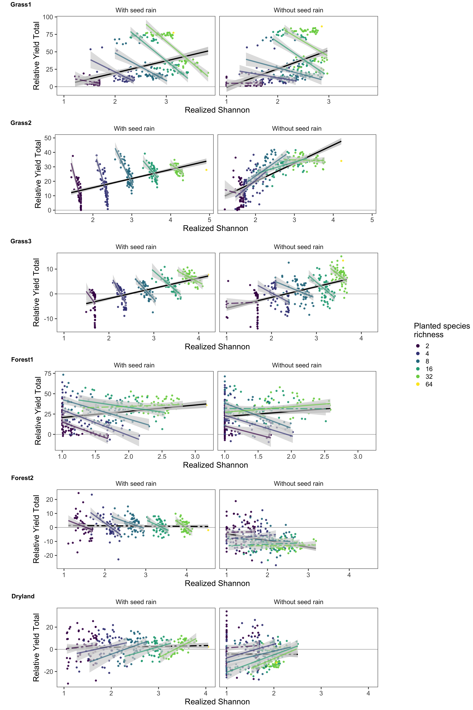
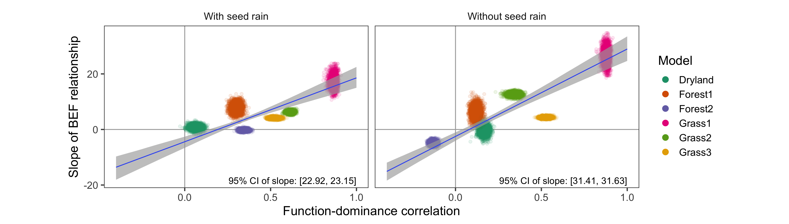
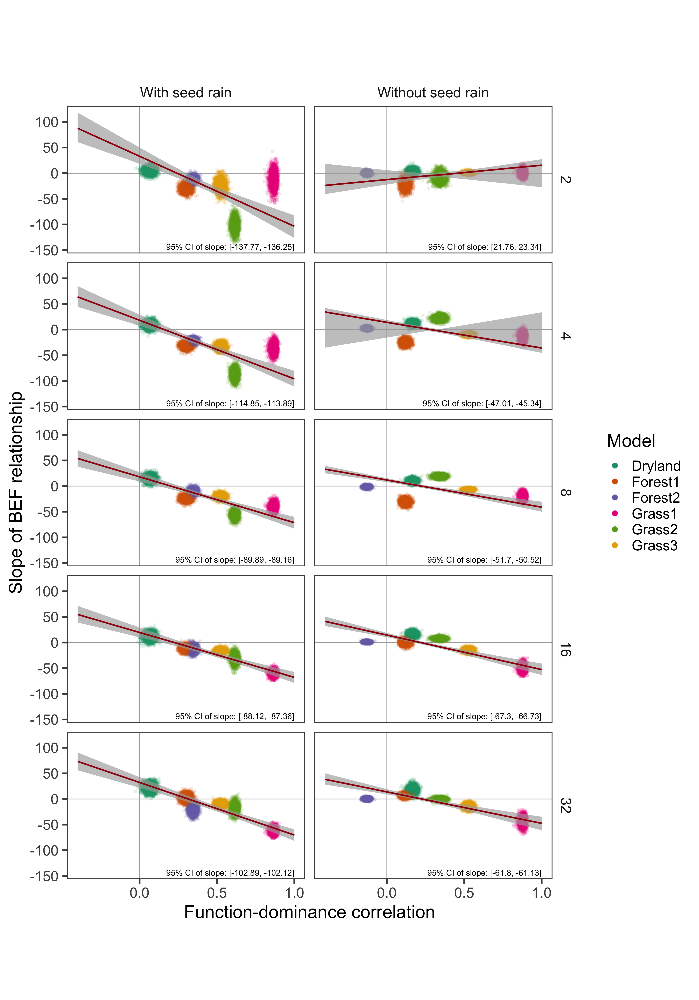

<style>
pre 
{
    overflow-x: auto;
}
pre code 
{
    word-wrap: normal;
    white-space: pre;
}
</style>

```{r setup-knitr, include = FALSE}

options(width = 1000)

library(knitr)
knitr::opts_chunk$set(echo = FALSE,
                      warning = FALSE,
                      message = FALSE,
                      size = "small",
                      dev = "png") 

```

In addition to conducting our analysis with biomass as the measurement of ecosystem function, in this document we report our results using `Relative Yield Total` (Loreau and Hector 2001; Wagg et al. 2019).

Mirroring the manuscript's central analysis, our models for the across-treatment effect were encoded as: `RelativeYieldTotal ~ -1 + Stage + Stage:Shannon`, and the within-treatment effect was encoded as: `RelativeYieldTotal ~ -1 + Richness:Stage + Richness:Stage:Shannon`. All models successfully converged, with Rhat values of `1.0`, and posterior predictive checks (PPC) were used to visually validate the model fits.


****************************************************************************************************
# Figure 2 - Counter-gradient

```{r fig-2, out.width = "800px"}



```

The relationship between Shannon diversity and Relative Yield Total was qualitatively similar to that of Shannon diversity for the majority of the models (5/6). 

Within Grass3, positive within-treatment slopes estimating total biomass flip to negative when estimating Relative Yield Total. This leads the model to more closely reflect the other two grassland models. Because conspecific negative density dependence (CNDD) is present within the model, species' monoculture biomasses are dramatically reduced in comparison to their biomasses within communities. Communities made of more competitive species will have lower Shannon diversity and higher Relative Yield Total, because there are few species present but they are released from the negative influence of CNDD. High diversity communities will generally have less total biomass per species, making each species' contribution to Relative Yield Total smaller. Because the positive influence of CNDD saturates as individuals become surrounded by heterospecifics, this decrease in Relative Yield Total is not outweighed by any corresponding increases in the strength of CNDD. This creates negative within-treatment relationships between Shannon diversity and Relative Yield Total.


****************************************************************************************************
# Figure 3 - Across-treatment effect

```{r fig-3, out.width = "800px"}



```

Considering the relationship between our measure of the internal coexistence processes within each model and the across-treatment effect of realized diversity on Relative Yield Total, we find that the aggregate patterns are nearly identical to those of total biomass. 


****************************************************************************************************
# Figure 4 - Within-treatment effect

```{r fig-4, out.width = "800px"}



```

Considering the relationship between our measure of the internal coexistence processes within each model and the within-treatment effect of realized diversity on Relative Yield Total, we find that the aggregate patterns are nearly identical to those of total biomass.


****************************************************************************************************
# Model validation

```{r setup, include=FALSE}

library(tidyverse)
library(knitr)
library(rstan)
library(brms)
library(tidybayes)
library(modelr)
library(sjstats)
library(sjPlot)

setwd(dirname(rstudioapi::getActiveDocumentContext()$path))
setwd("../data/brms_models")

models <- readRDS(file = "relative_yield_total_brms_models.rds") %>% 
    filter(measure == "Shannon")

```

This section of the document describes the statistical models' validation, using **Shannon diversity** as the focal biodiversity metric and **Relative Yield Total** as the focal ecosystem function.

Important terms:

* `Stage`: With seed rain, Without seed rain
* `Ninitial`: Planted species richness


****************************************************************************************************
## Grass1

Clark, A. T., C. Lehman, and D. Tilman. 2018. Identifying mechanisms that structure ecological communities by snapping model parameters to empirically observed trade-offs. Ecology Letters 21:494–505.

```{r Grass1-setup, include=FALSE}

Grass1 <- models %>% filter(Model == "Grass1") %>% unlist(recursive = FALSE)

```

### Across-treatment effect

A summary table of the BRMS model results:
```{r Grass1-across-treatment-effect}

Grass1$mainEffect

```
> Note the `Rhat` summary column: variation from 1.0 indicates the the model did not converge.

The Bayesian R-squared:
```{r Grass1-across-treatment-effect-R2}

rstantools::bayes_R2(Grass1$mainEffect)

```

****************************************************************************************************
#### Posterior predictive checks

We next use posterior predictive checks (PPC) to judge the fit of the model. These compare the real data to the posterior distribution, conditioned on the observed data.

##### Density plot
The density of both the real data (`y`, black line), and from fitted draws of the models (`y_rep`, blue lines).
```{r Grass1-across-treatment-PPC-PDF}

brms::pp_check(Grass1$mainEffect) +
    labs(x = "Total biomass") +
    theme_bw() 

```

##### Scatter plot
Average prediction (`y_rep`) for each real data point (`y`). A line indicates a 1:1 correspondence for reference.
```{r Grass1-across-treatment-scatter-avg}

brms::pp_check(Grass1$mainEffect,
               type = 'scatter_avg_grouped',
               group = "Stage") +
    geom_abline(intercept = 0,
                slope = 1) +
    labs(title = "Realized total biomass to average predicted total biomass") +
    theme_bw()

```

##### Highest-density interval
Highest-density interval (HDI) for each effect within the model. This characterizes the uncertainty of our posterior distributions. Highest-density intervals can be thought of as credibility intervals (see [here](https://mathematica.stackexchange.com/questions/173282/computing-credible-region-highest-posterior-density-from-empirical-distributio)). We use the 89% HDI as recommended by Kruschke (2014), see [here](https://easystats.github.io/bayestestR/reference/hdi.html) for more information.
```{r Grass1-across-treatment-HDI}

sjPlot::plot_model(Grass1$mainEffect,
                   title = "89% Highest-density intervals")

```

****************************************************************************************************
### Within-treatment effect

A summary table of the BRMS model results:
```{r Grass1-within-treatment-effect-display}

Grass1$treatmentEffect

```
> Note the `Rhat` summary column: variation from 1.0 indicates the the model did not converge.

The Bayesian R-squared:
```{r Grass1-within-treatment-effect-R2}

rstantools::bayes_R2(Grass1$treatmentEffect)

```

****************************************************************************************************
#### Posterior predictive checks

##### Density plot

The density of both the real data (`y`, black line), and from fitted draws of the models (`y_rep`, blue lines).
```{r Grass1-within-treatment-effect-PPC-PDF}

brms::pp_check(Grass1$treatmentEffect) +
    labs(x = "Total biomass") +
    theme_bw()

```

##### Scatter plot

Average prediction (`y_rep`) for each real data point (`y`), grouping the comparison of `y` to `y_rep` by `Ninitial`. A line indicates a 1:1 correspondence for reference.
```{r Grass1-within-treatment-effect-PPC-scatter-avg}

brms::pp_check(Grass1$treatmentEffect,
               type = 'scatter_avg_grouped',
               group = "Ninitial") +
    geom_abline(intercept = 0,
                slope = 1) +
    labs(title = "Realized total biomass to average predicted total biomass") +
    theme_bw()

```

##### Highest-density interval

Highest-density interval (HDI) for each effect within the model. This characterizes the uncertainty of our posterior distributions. Highest-density intervals can be thought of as credibility intervals (see [here](https://mathematica.stackexchange.com/questions/173282/computing-credible-region-highest-posterior-density-from-empirical-distributio)). We use the 89% HDI as recommended by Kruschke (2014), see [here](https://easystats.github.io/bayestestR/reference/hdi.html) for more information.
```{r Grass1-within-treatment-effect-HDI}

sjPlot::plot_model(Grass1$treatmentEffect,
                   title = "89% Highest-density intervals")

```

****************************************************************************************************
## Grass2

Turnbull, L. A., J. M. Levine, M. Loreau, and A. Hector. 2013. Coexistence, niches and biodiversity effects on ecosystem functioning. Ecology Letters 16:116–127.

```{r Grass2-setup, include=FALSE}

Grass2 <- models %>% filter(Model == "Grass2") %>% unlist(recursive = FALSE)

```

### Across-treatment effect

A summary table of the BRMS model results:
```{r Grass2-across-treatment-effect}

Grass2$mainEffect

```
> Note the `Rhat` summary column: variation from 1.0 indicates the the model did not converge.

The Bayesian R-squared:
```{r Grass2-across-treatment-effect-R2}

rstantools::bayes_R2(Grass2$mainEffect)

```

****************************************************************************************************
#### Posterior predictive checks

We next use posterior predictive checks (PPC) to judge the fit of the model. These compare the real data to the posterior distribution, conditioned on the observed data.

##### Density plot
The density of both the real data (`y`, black line), and from fitted draws of the models (`y_rep`, blue lines).
```{r Grass2-across-treatment-PPC-PDF}

brms::pp_check(Grass2$mainEffect) +
    labs(x = "Total biomass") +
    theme_bw() 

```

##### Scatter plot
Average prediction (`y_rep`) for each real data point (`y`). A line indicates a 1:1 correspondence for reference.
```{r Grass2-across-treatment-scatter-avg}

brms::pp_check(Grass2$mainEffect,
               type = 'scatter_avg_grouped',
               group = "Stage") +
    geom_abline(intercept = 0,
                slope = 1) +
    labs(title = "Realized total biomass to average predicted total biomass") +
    theme_bw()

```

##### Highest-density interval
Highest-density interval (HDI) for each effect within the model. This characterizes the uncertainty of our posterior distributions. Highest-density intervals can be thought of as credibility intervals (see [here](https://mathematica.stackexchange.com/questions/173282/computing-credible-region-highest-posterior-density-from-empirical-distributio)). We use the 89% HDI as recommended by Kruschke (2014), see [here](https://easystats.github.io/bayestestR/reference/hdi.html) for more information.
```{r Grass2-across-treatment-HDI}

sjPlot::plot_model(Grass2$mainEffect,
                   title = "89% Highest-density intervals")

```

****************************************************************************************************
### Within-treatment effect

A summary table of the BRMS model results:
```{r Grass2-within-treatment-effect-display}

Grass2$treatmentEffect

```
> Note the `Rhat` summary column: variation from 1.0 indicates the the model did not converge.

The Bayesian R-squared:
```{r Grass2-within-treatment-effect-R2}

rstantools::bayes_R2(Grass2$treatmentEffect)

```

****************************************************************************************************
#### Posterior predictive checks

##### Density plot

The density of both the real data (`y`, black line), and from fitted draws of the models (`y_rep`, blue lines).
```{r Grass2-within-treatment-effect-PPC-PDF}

brms::pp_check(Grass2$treatmentEffect) +
    labs(x = "Total biomass") +
    theme_bw()

```

##### Scatter plot

Average prediction (`y_rep`) for each real data point (`y`), grouping the comparison of `y` to `y_rep` by `Ninitial`. A line indicates a 1:1 correspondence for reference.
```{r Grass2-within-treatment-effect-PPC-scatter-avg}

brms::pp_check(Grass2$treatmentEffect,
               type = 'scatter_avg_grouped',
               group = "Ninitial") +
    geom_abline(intercept = 0,
                slope = 1) +
    labs(title = "Realized total biomass to average predicted total biomass") +
    theme_bw()

```

##### Highest-density interval

Highest-density interval (HDI) for each effect within the model. This characterizes the uncertainty of our posterior distributions. Highest-density intervals can be thought of as credibility intervals (see [here](https://mathematica.stackexchange.com/questions/173282/computing-credible-region-highest-posterior-density-from-empirical-distributio)). We use the 89% HDI as recommended by Kruschke (2014), see [here](https://easystats.github.io/bayestestR/reference/hdi.html) for more information.
```{r Grass2-within-treatment-effect-HDI}

sjPlot::plot_model(Grass2$treatmentEffect,
                   title = "89% Highest-density intervals")

```

****************************************************************************************************
## Grass3

May, F., V. Grimm, and F. Jeltsch. 2009. Reversed effects of grazing on plant diversity: The role of below-ground competition and size symmetry. Oikos 118:1830–1843.

```{r Grass3-setup, include=FALSE}

Grass3 <- models %>% filter(Model == "Grass3") %>% unlist(recursive = FALSE)

```

### Across-treatment effect

A summary table of the BRMS model results:
```{r Grass3-across-treatment-effect}

Grass3$mainEffect

```
> Note the `Rhat` summary column: variation from 1.0 indicates the the model did not converge.

The Bayesian R-squared:
```{r Grass3-across-treatment-effect-R2}

rstantools::bayes_R2(Grass3$mainEffect)

```

****************************************************************************************************
#### Posterior predictive checks

We next use posterior predictive checks (PPC) to judge the fit of the model. These compare the real data to the posterior distribution, conditioned on the observed data.

##### Density plot
The density of both the real data (`y`, black line), and from fitted draws of the models (`y_rep`, blue lines).
```{r Grass3-across-treatment-PPC-PDF}

brms::pp_check(Grass3$mainEffect) +
    labs(x = "Total biomass") +
    theme_bw() 

```

##### Scatter plot
Average prediction (`y_rep`) for each real data point (`y`). A line indicates a 1:1 correspondence for reference.
```{r Grass3-across-treatment-scatter-avg}

brms::pp_check(Grass3$mainEffect,
               type = 'scatter_avg_grouped',
               group = "Stage") +
    geom_abline(intercept = 0,
                slope = 1) +
    labs(title = "Realized total biomass to average predicted total biomass") +
    theme_bw()

```

##### Highest-density interval
Highest-density interval (HDI) for each effect within the model. This characterizes the uncertainty of our posterior distributions. Highest-density intervals can be thought of as credibility intervals (see [here](https://mathematica.stackexchange.com/questions/173282/computing-credible-region-highest-posterior-density-from-empirical-distributio)). We use the 89% HDI as recommended by Kruschke (2014), see [here](https://easystats.github.io/bayestestR/reference/hdi.html) for more information.
```{r Grass3-across-treatment-HDI}

sjPlot::plot_model(Grass3$mainEffect,
                   title = "89% Highest-density intervals")

```

****************************************************************************************************
### Within-treatment effect

A summary table of the BRMS model results:
```{r Grass3-within-treatment-effect-display}

Grass3$treatmentEffect

```
> Note the `Rhat` summary column: variation from 1.0 indicates the the model did not converge.

The Bayesian R-squared:
```{r Grass3-within-treatment-effect-R2}

rstantools::bayes_R2(Grass3$treatmentEffect)

```

****************************************************************************************************
#### Posterior predictive checks

##### Density plot

The density of both the real data (`y`, black line), and from fitted draws of the models (`y_rep`, blue lines).
```{r Grass3-within-treatment-effect-PPC-PDF}

brms::pp_check(Grass3$treatmentEffect) +
    labs(x = "Total biomass") +
    theme_bw()

```

##### Scatter plot

Average prediction (`y_rep`) for each real data point (`y`), grouping the comparison of `y` to `y_rep` by `Ninitial`. A line indicates a 1:1 correspondence for reference.
```{r Grass3-within-treatment-effect-PPC-scatter-avg}

brms::pp_check(Grass3$treatmentEffect,
               type = 'scatter_avg_grouped',
               group = "Ninitial") +
    geom_abline(intercept = 0,
                slope = 1) +
    labs(title = "Realized total biomass to average predicted total biomass") +
    theme_bw()

```

##### Highest-density interval

Highest-density interval (HDI) for each effect within the model. This characterizes the uncertainty of our posterior distributions. Highest-density intervals can be thought of as credibility intervals (see [here](https://mathematica.stackexchange.com/questions/173282/computing-credible-region-highest-posterior-density-from-empirical-distributio)). We use the 89% HDI as recommended by Kruschke (2014), see [here](https://easystats.github.io/bayestestR/reference/hdi.html) for more information.
```{r Grass3-within-treatment-effect-HDI}

sjPlot::plot_model(Grass3$treatmentEffect,
                   title = "89% Highest-density intervals")

```


****************************************************************************************************
## Forest1

Rüger, N., R. Condit, D. H. Dent, S. J. DeWalt, S. P. Hubbell, J. W. Lichstein, O. R. Lopez, C. Wirth, and C. E. Farrior. 2020. Demographic trade-offs predict tropical forest dynamics. Science 368:165–168.

```{r Forest1-setup, include=FALSE}

Forest1 <- models %>% filter(Model == "Forest1") %>% unlist(recursive = FALSE)

```

### Across-treatment effect

A summary table of the BRMS model results:
```{r Forest1-across-treatment-effect}

Forest1$mainEffect

```
> Note the `Rhat` summary column: variation from 1.0 indicates the the model did not converge.

The Bayesian R-squared:
```{r Forest1-across-treatment-effect-R2}

rstantools::bayes_R2(Forest1$mainEffect)

```

****************************************************************************************************
#### Posterior predictive checks

We next use posterior predictive checks (PPC) to judge the fit of the model. These compare the real data to the posterior distribution, conditioned on the observed data.

##### Density plot
The density of both the real data (`y`, black line), and from fitted draws of the models (`y_rep`, blue lines).
```{r Forest1-across-treatment-PPC-PDF}

brms::pp_check(Forest1$mainEffect) +
    labs(x = "Total biomass") +
    theme_bw() 

```

##### Scatter plot
Average prediction (`y_rep`) for each real data point (`y`). A line indicates a 1:1 correspondence for reference.
```{r Forest1-across-treatment-scatter-avg}

brms::pp_check(Forest1$mainEffect,
               type = 'scatter_avg_grouped',
               group = "Stage") +
    geom_abline(intercept = 0,
                slope = 1) +
    labs(title = "Realized total biomass to average predicted total biomass") +
    theme_bw()

```

##### Highest-density interval
Highest-density interval (HDI) for each effect within the model. This characterizes the uncertainty of our posterior distributions. Highest-density intervals can be thought of as credibility intervals (see [here](https://mathematica.stackexchange.com/questions/173282/computing-credible-region-highest-posterior-density-from-empirical-distributio)). We use the 89% HDI as recommended by Kruschke (2014), see [here](https://easystats.github.io/bayestestR/reference/hdi.html) for more information.
```{r Forest1-across-treatment-HDI}

sjPlot::plot_model(Forest1$mainEffect,
                   title = "89% Highest-density intervals")

```

****************************************************************************************************
### Within-treatment effect

A summary table of the BRMS model results:
```{r Forest1-within-treatment-effect-display}

Forest1$treatmentEffect

```
> Note the `Rhat` summary column: variation from 1.0 indicates the the model did not converge.

The Bayesian R-squared:
```{r Forest1-within-treatment-effect-R2}

rstantools::bayes_R2(Forest1$treatmentEffect)

```

****************************************************************************************************
#### Posterior predictive checks

##### Density plot

The density of both the real data (`y`, black line), and from fitted draws of the models (`y_rep`, blue lines).
```{r Forest1-within-treatment-effect-PPC-PDF}

brms::pp_check(Forest1$treatmentEffect) +
    labs(x = "Total biomass") +
    theme_bw()

```

##### Scatter plot

Average prediction (`y_rep`) for each real data point (`y`), grouping the comparison of `y` to `y_rep` by `Ninitial`. A line indicates a 1:1 correspondence for reference.
```{r Forest1-within-treatment-effect-PPC-scatter-avg}

brms::pp_check(Forest1$treatmentEffect,
               type = 'scatter_avg_grouped',
               group = "Ninitial") +
    geom_abline(intercept = 0,
                slope = 1) +
    labs(title = "Realized total biomass to average predicted total biomass") +
    theme_bw()

```

##### Highest-density interval

Highest-density interval (HDI) for each effect within the model. This characterizes the uncertainty of our posterior distributions. Highest-density intervals can be thought of as credibility intervals (see [here](https://mathematica.stackexchange.com/questions/173282/computing-credible-region-highest-posterior-density-from-empirical-distributio)). We use the 89% HDI as recommended by Kruschke (2014), see [here](https://easystats.github.io/bayestestR/reference/hdi.html) for more information.
```{r Forest1-within-treatment-effect-HDI}

sjPlot::plot_model(Forest1$treatmentEffect,
                   title = "89% Highest-density intervals")

```


****************************************************************************************************
## Forest2

Maréchaux, I., and J. Chave. 2017. An individual-based forest model to jointly simulate carbon and tree diversity in Amazonia: description and applications. Ecological Monographs.

```{r Forest2-setup, include=FALSE}

Forest2 <- models %>% filter(Model == "Forest2") %>% unlist(recursive = FALSE)

```

### Across-treatment effect

A summary table of the BRMS model results:
```{r Forest2-across-treatment-effect}

Forest2$mainEffect

```
> Note the `Rhat` summary column: variation from 1.0 indicates the the model did not converge.

The Bayesian R-squared:
```{r Forest2-across-treatment-effect-R2}

rstantools::bayes_R2(Forest2$mainEffect)

```

****************************************************************************************************
#### Posterior predictive checks

We next use posterior predictive checks (PPC) to judge the fit of the model. These compare the real data to the posterior distribution, conditioned on the observed data.

##### Density plot
The density of both the real data (`y`, black line), and from fitted draws of the models (`y_rep`, blue lines).
```{r Forest2-across-treatment-PPC-PDF}

brms::pp_check(Forest2$mainEffect) +
    labs(x = "Total biomass") +
    theme_bw() 

```

##### Scatter plot
Average prediction (`y_rep`) for each real data point (`y`). A line indicates a 1:1 correspondence for reference.
```{r Forest2-across-treatment-scatter-avg}

brms::pp_check(Forest2$mainEffect,
               type = 'scatter_avg_grouped',
               group = "Stage") +
    geom_abline(intercept = 0,
                slope = 1) +
    labs(title = "Realized total biomass to average predicted total biomass") +
    theme_bw()

```

##### Highest-density interval
Highest-density interval (HDI) for each effect within the model. This characterizes the uncertainty of our posterior distributions. Highest-density intervals can be thought of as credibility intervals (see [here](https://mathematica.stackexchange.com/questions/173282/computing-credible-region-highest-posterior-density-from-empirical-distributio)). We use the 89% HDI as recommended by Kruschke (2014), see [here](https://easystats.github.io/bayestestR/reference/hdi.html) for more information.
```{r Forest2-across-treatment-HDI}

sjPlot::plot_model(Forest2$mainEffect,
                   title = "89% Highest-density intervals")

```

****************************************************************************************************
### Within-treatment effect

A summary table of the BRMS model results:
```{r Forest2-within-treatment-effect-display}

Forest2$treatmentEffect

```
> Note the `Rhat` summary column: variation from 1.0 indicates the the model did not converge.

The Bayesian R-squared:
```{r Forest2-within-treatment-effect-R2}

rstantools::bayes_R2(Forest2$treatmentEffect)

```

****************************************************************************************************
#### Posterior predictive checks

##### Density plot

The density of both the real data (`y`, black line), and from fitted draws of the models (`y_rep`, blue lines).
```{r Forest2-within-treatment-effect-PPC-PDF}

brms::pp_check(Forest2$treatmentEffect) +
    labs(x = "Total biomass") +
    theme_bw()

```

##### Scatter plot

Average prediction (`y_rep`) for each real data point (`y`), grouping the comparison of `y` to `y_rep` by `Ninitial`. A line indicates a 1:1 correspondence for reference.
```{r Forest2-within-treatment-effect-PPC-scatter-avg}

brms::pp_check(Forest2$treatmentEffect,
               type = 'scatter_avg_grouped',
               group = "Ninitial") +
    geom_abline(intercept = 0,
                slope = 1) +
    labs(title = "Realized total biomass to average predicted total biomass") +
    theme_bw()

```

##### Highest-density interval

Highest-density interval (HDI) for each effect within the model. This characterizes the uncertainty of our posterior distributions. Highest-density intervals can be thought of as credibility intervals (see [here](https://mathematica.stackexchange.com/questions/173282/computing-credible-region-highest-posterior-density-from-empirical-distributio)). We use the 89% HDI as recommended by Kruschke (2014), see [here](https://easystats.github.io/bayestestR/reference/hdi.html) for more information.
```{r Forest2-within-treatment-effect-HDI}

sjPlot::plot_model(Forest2$treatmentEffect,
                   title = "89% Highest-density intervals")

```


****************************************************************************************************
## Dryland

Reineking, B., M. Veste, C. Wissel, and A. Huth. 2006. Environmental variability and allocation trade-offs maintain species diversity in a process-based model of succulent plant communities. Ecological Modelling.

```{r Dryland-setup, include=FALSE}

Dryland <- models %>% filter(Model == "Dryland") %>% unlist(recursive = FALSE)

```

### Across-treatment effect

A summary table of the BRMS model results:
```{r Dryland-across-treatment-effect}

Dryland$mainEffect

```
> Note the `Rhat` summary column: variation from 1.0 indicates the the model did not converge.

The Bayesian R-squared:
```{r Dryland-across-treatment-effect-R2}

rstantools::bayes_R2(Dryland$mainEffect)

```

****************************************************************************************************
#### Posterior predictive checks

We next use posterior predictive checks (PPC) to judge the fit of the model. These compare the real data to the posterior distribution, conditioned on the observed data.

##### Density plot
The density of both the real data (`y`, black line), and from fitted draws of the models (`y_rep`, blue lines).
```{r Dryland-across-treatment-PPC-PDF}

brms::pp_check(Dryland$mainEffect) +
    labs(x = "Total biomass") +
    theme_bw() 

```

##### Scatter plot
Average prediction (`y_rep`) for each real data point (`y`). A line indicates a 1:1 correspondence for reference.
```{r Dryland-across-treatment-scatter-avg}

brms::pp_check(Dryland$mainEffect,
               type = 'scatter_avg_grouped',
               group = "Stage") +
    geom_abline(intercept = 0,
                slope = 1) +
    labs(title = "Realized total biomass to average predicted total biomass") +
    theme_bw()

```

##### Highest-density interval
Highest-density interval (HDI) for each effect within the model. This characterizes the uncertainty of our posterior distributions. Highest-density intervals can be thought of as credibility intervals (see [here](https://mathematica.stackexchange.com/questions/173282/computing-credible-region-highest-posterior-density-from-empirical-distributio)). We use the 89% HDI as recommended by Kruschke (2014), see [here](https://easystats.github.io/bayestestR/reference/hdi.html) for more information.
```{r Dryland-across-treatment-HDI}

sjPlot::plot_model(Dryland$mainEffect,
                   title = "89% Highest-density intervals")

```

****************************************************************************************************
### Within-treatment effect

A summary table of the BRMS model results:
```{r Dryland-within-treatment-effect-display}

Dryland$treatmentEffect

```
> Note the `Rhat` summary column: variation from 1.0 indicates the the model did not converge.

The Bayesian R-squared:
```{r Dryland-within-treatment-effect-R2}

rstantools::bayes_R2(Dryland$treatmentEffect)

```

****************************************************************************************************
#### Posterior predictive checks

##### Density plot

The density of both the real data (`y`, black line), and from fitted draws of the models (`y_rep`, blue lines).
```{r Dryland-within-treatment-effect-PPC-PDF}

brms::pp_check(Dryland$treatmentEffect) +
    labs(x = "Total biomass") +
    theme_bw()

```

##### Scatter plot

Average prediction (`y_rep`) for each real data point (`y`), grouping the comparison of `y` to `y_rep` by `Ninitial`. A line indicates a 1:1 correspondence for reference.
```{r Dryland-within-treatment-effect-PPC-scatter-avg}

brms::pp_check(Dryland$treatmentEffect,
               type = 'scatter_avg_grouped',
               group = "Ninitial") +
    geom_abline(intercept = 0,
                slope = 1) +
    labs(title = "Realized total biomass to average predicted total biomass") +
    theme_bw()

```

##### Highest-density interval

Highest-density interval (HDI) for each effect within the model. This characterizes the uncertainty of our posterior distributions. Highest-density intervals can be thought of as credibility intervals (see [here](https://mathematica.stackexchange.com/questions/173282/computing-credible-region-highest-posterior-density-from-empirical-distributio)). We use the 89% HDI as recommended by Kruschke (2014), see [here](https://easystats.github.io/bayestestR/reference/hdi.html) for more information.
```{r Dryland-within-treatment-effect-HDI}

sjPlot::plot_model(Dryland$treatmentEffect,
                   title = "89% Highest-density intervals")

```
