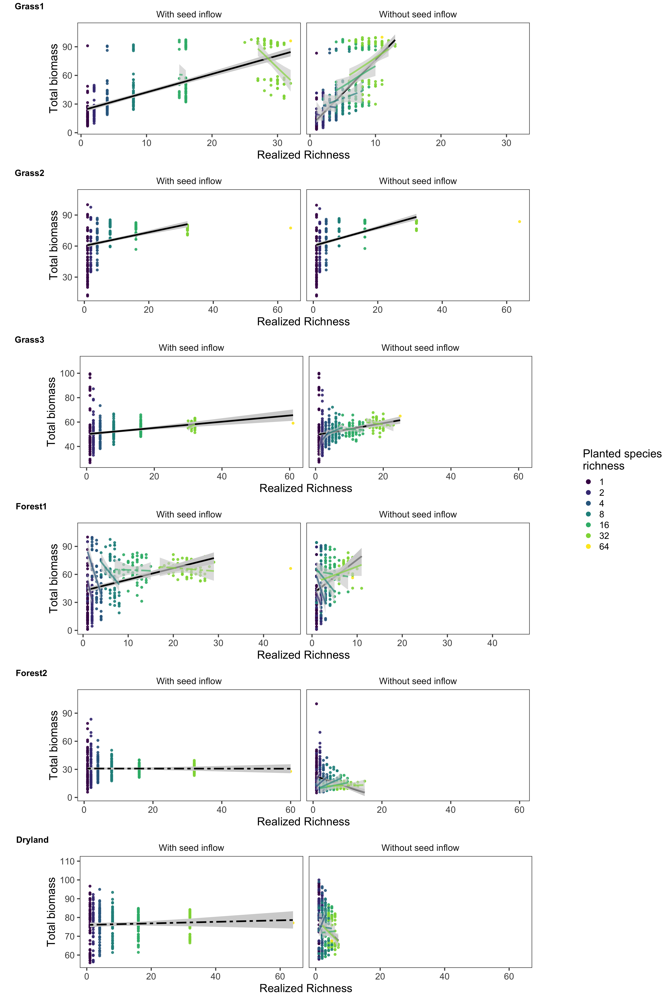
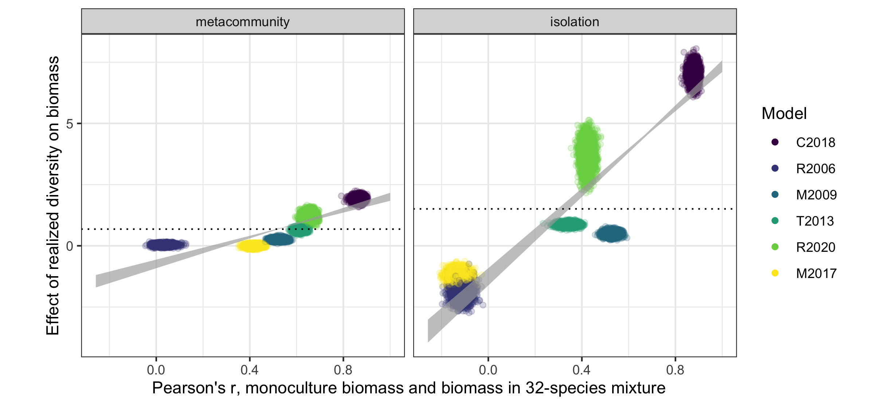

<style>
pre 
{
    overflow-x: auto;
}
pre code 
{
    word-wrap: normal;
    white-space: pre;
}
</style>

```{r setup-knitr, include = FALSE}

options(width = 1000)

library(knitr)
knitr::opts_chunk$set(echo = FALSE,
                      warning = FALSE,
                      message = FALSE,
                      size = "small",
                      dev = "png") 

```

In addition to `Shannon` diversity, reported in the manuscript, we conducted the analysis using `richness` as our focal diversity metric. During the `with seed rain` stage, external seed addition is added to the simulated plant communities. This external seed addition is calculated to be 100% of the average monoculture seed rain across all species. Therefore, even rare species are able to maintain low population sizes. For this reason, there is often no slope within each planted species richness treatment. In other words, all communities that began with 32-species will continuously contain 32-species, because of seed addition. We thus report only the across-richness treatment models, omitting those within-richness treatments because they are invalid models.

Mirroring `Shannon` diversity in the manuscript, our models for the across-treatment effect were encoded as: `Biomass ~ -1 + Stage + Stage:Richness`. All models successfully converged, with Rhat values of `1.0`, and posterior predictive checks (PPC) were used to visually validate the model fits.


****************************************************************************************************
# Figure 2 - Counter-gradient

```{r fig-2, out.width = "800px"}



```

The relationship between richness and total biomass was qualitatively similar to that of Shannon diversity. The direction and magnitude of the relationship between richness a total biomass are consistent across all of the models. The only variation between results is that in Forest2, the significance of the seed rain and no seed rain estimates both change; the seed rain slope becomes significant, though maintaining almost no slope, and further the no seed rain phase becomes insignificant, though again maintaining its general slope.


****************************************************************************************************
# Figure 3 - Across-treatment effect

```{r fig-3a, out.width = "800px"}



```

Again, the general structure of the relationship between the communities' underlying coexistence dynamics and their emergent BEF relationship are maintained. The only qualitative difference is that the slope of the interaction is significantly less steep during the seed rain phase. This results stems from richness not fully capturing the changes in species composition within the communities. Because seed addition ensures most species are likely present within the plots, richness during the seed rain phase is unlikely to change.


****************************************************************************************************
# Model validation

```{r setup, include=FALSE}

options(width = 1000)

library(tidyverse)
library(knitr)
library(rstan)
library(brms)
library(tidybayes)
library(modelr)
library(sjstats)
library(sjPlot)

setwd(dirname(rstudioapi::getActiveDocumentContext()$path))
setwd("../data/brms_models")

models <- readRDS(file = "biomass_brms_models.rds") %>% 
    filter(measure == "Richness")

```

This section of the document describes the statistical models' validation, using **richness** as the focal biodiversity metric and **total biomass** as the focal ecosystem function.

Important terms:

* `Stage`: With seed rain, without seed rain
* `Ninitial`: Planted species richness


****************************************************************************************************
## Grass1

Clark, A. T., C. Lehman, and D. Tilman. 2018. Identifying mechanisms that structure ecological communities by snapping model parameters to empirically observed trade-offs. Ecology Letters 21:494–505.

```{r Grass1-setup, include=FALSE}

Grass1 <- models %>% filter(Model == "Grass1") %>% unlist(recursive = FALSE)

```

### Across-treatment effect

A summary table of the BRMS model results:
```{r Grass1-across-treatment-effect}

Grass1$mainEffect

```
> Note the `Rhat` summary column: variation from 1.0 indicates the the model did not converge.

The Bayesian R-squared:
```{r Grass1-across-treatment-effect-R2}

rstantools::bayes_R2(Grass1$mainEffect)

```

****************************************************************************************************
### Posterior predictive checks

We next use posterior predictive checks (PPC) to judge the fit of the model. These compare the real data to the posterior distribution, conditioned on the observed data.

#### Density plot
The density of both the real data (`y`, black line), and from fitted draws of the models (`y_rep`, blue lines).
```{r Grass1-across-treatment-PPC-PDF}

brms::pp_check(Grass1$mainEffect) +
    labs(x = "Total biomass") +
    theme_bw() 

```

#### Scatter plot
Average prediction (`y_rep`) for each real data point (`y`). A line indicates a 1:1 correspondence for reference.
```{r Grass1-across-treatment-scatter-avg}

brms::pp_check(Grass1$mainEffect,
               type = 'scatter_avg_grouped',
               group = "Stage") +
    geom_abline(intercept = 0,
                slope = 1) +
    labs(title = "Realized total biomass to average predicted total biomass") +
    theme_bw()

```

#### Highest-density interval
Highest-density interval (HDI) for each effect within the model. This characterizes the uncertainty of our posterior distributions. Highest-density intervals can be thought of as credibility intervals (see [here](https://mathematica.stackexchange.com/questions/173282/computing-credible-region-highest-posterior-density-from-empirical-distributio)). We use the 89% HDI as recommended by Kruschke (2014), see [here](https://easystats.github.io/bayestestR/reference/hdi.html) for more information.
```{r Grass1-across-treatment-HDI}

sjPlot::plot_model(Grass1$mainEffect,
                   title = "89% Highest-density intervals")

```

****************************************************************************************************
## Grass2

Turnbull, L. A., J. M. Levine, M. Loreau, and A. Hector. 2013. Coexistence, niches and biodiversity effects on ecosystem functioning. Ecology Letters 16:116–127.

```{r Grass2-setup, include=FALSE}

Grass2 <- models %>% filter(Model == "Grass2") %>% unlist(recursive = FALSE)

```

### Across-treatment effect

A summary table of the BRMS model results:
```{r Grass2-across-treatment-effect}

Grass2$mainEffect

```
> Note the `Rhat` summary column: variation from 1.0 indicates the the model did not converge.

The Bayesian R-squared:
```{r Grass2-across-treatment-effect-R2}

rstantools::bayes_R2(Grass2$mainEffect)

```

****************************************************************************************************
### Posterior predictive checks

We next use posterior predictive checks (PPC) to judge the fit of the model. These compare the real data to the posterior distribution, conditioned on the observed data.

#### Density plot
The density of both the real data (`y`, black line), and from fitted draws of the models (`y_rep`, blue lines).
```{r Grass2-across-treatment-PPC-PDF}

brms::pp_check(Grass2$mainEffect) +
    labs(x = "Total biomass") +
    theme_bw() 

```

#### Scatter plot
Average prediction (`y_rep`) for each real data point (`y`). A line indicates a 1:1 correspondence for reference.
```{r Grass2-across-treatment-scatter-avg}

brms::pp_check(Grass2$mainEffect,
               type = 'scatter_avg_grouped',
               group = "Stage") +
    geom_abline(intercept = 0,
                slope = 1) +
    labs(title = "Realized total biomass to average predicted total biomass") +
    theme_bw()

```

#### Highest-density interval
Highest-density interval (HDI) for each effect within the model. This characterizes the uncertainty of our posterior distributions. Highest-density intervals can be thought of as credibility intervals (see [here](https://mathematica.stackexchange.com/questions/173282/computing-credible-region-highest-posterior-density-from-empirical-distributio)). We use the 89% HDI as recommended by Kruschke (2014), see [here](https://easystats.github.io/bayestestR/reference/hdi.html) for more information.
```{r Grass2-across-treatment-HDI}

sjPlot::plot_model(Grass2$mainEffect,
                   title = "89% Highest-density intervals")

```

****************************************************************************************************
## Grass3

May, F., V. Grimm, and F. Jeltsch. 2009. Reversed effects of grazing on plant diversity: The role of below-ground competition and size symmetry. Oikos 118:1830–1843.

```{r Grass3-setup, include=FALSE}

Grass3 <- models %>% filter(Model == "Grass3") %>% unlist(recursive = FALSE)

```

### Across-treatment effect

A summary table of the BRMS model results:
```{r Grass3-across-treatment-effect}

Grass3$mainEffect

```
> Note the `Rhat` summary column: variation from 1.0 indicates the the model did not converge.

The Bayesian R-squared:
```{r Grass3-across-treatment-effect-R2}

rstantools::bayes_R2(Grass3$mainEffect)

```

****************************************************************************************************
### Posterior predictive checks

We next use posterior predictive checks (PPC) to judge the fit of the model. These compare the real data to the posterior distribution, conditioned on the observed data.

#### Density plot
The density of both the real data (`y`, black line), and from fitted draws of the models (`y_rep`, blue lines).
```{r Grass3-across-treatment-PPC-PDF}

brms::pp_check(Grass3$mainEffect) +
    labs(x = "Total biomass") +
    theme_bw() 

```

#### Scatter plot
Average prediction (`y_rep`) for each real data point (`y`). A line indicates a 1:1 correspondence for reference.
```{r Grass3-across-treatment-scatter-avg}

brms::pp_check(Grass3$mainEffect,
               type = 'scatter_avg_grouped',
               group = "Stage") +
    geom_abline(intercept = 0,
                slope = 1) +
    labs(title = "Realized total biomass to average predicted total biomass") +
    theme_bw()

```

#### Highest-density interval
Highest-density interval (HDI) for each effect within the model. This characterizes the uncertainty of our posterior distributions. Highest-density intervals can be thought of as credibility intervals (see [here](https://mathematica.stackexchange.com/questions/173282/computing-credible-region-highest-posterior-density-from-empirical-distributio)). We use the 89% HDI as recommended by Kruschke (2014), see [here](https://easystats.github.io/bayestestR/reference/hdi.html) for more information.
```{r Grass3-across-treatment-HDI}

sjPlot::plot_model(Grass3$mainEffect,
                   title = "89% Highest-density intervals")

```


****************************************************************************************************
## Forest1

Rüger, N., R. Condit, D. H. Dent, S. J. DeWalt, S. P. Hubbell, J. W. Lichstein, O. R. Lopez, C. Wirth, and C. E. Farrior. 2020. Demographic trade-offs predict tropical forest dynamics. Science 368:165–168.

```{r Forest1-setup, include=FALSE}

Forest1 <- models %>% filter(Model == "Forest1") %>% unlist(recursive = FALSE)

```

### Across-treatment effect

A summary table of the BRMS model results:
```{r Forest1-across-treatment-effect}

Forest1$mainEffect

```
> Note the `Rhat` summary column: variation from 1.0 indicates the the model did not converge.

The Bayesian R-squared:
```{r Forest1-across-treatment-effect-R2}

rstantools::bayes_R2(Forest1$mainEffect)

```

****************************************************************************************************
### Posterior predictive checks

We next use posterior predictive checks (PPC) to judge the fit of the model. These compare the real data to the posterior distribution, conditioned on the observed data.

#### Density plot
The density of both the real data (`y`, black line), and from fitted draws of the models (`y_rep`, blue lines).
```{r Forest1-across-treatment-PPC-PDF}

brms::pp_check(Forest1$mainEffect) +
    labs(x = "Total biomass") +
    theme_bw() 

```

#### Scatter plot
Average prediction (`y_rep`) for each real data point (`y`). A line indicates a 1:1 correspondence for reference.
```{r Forest1-across-treatment-scatter-avg}

brms::pp_check(Forest1$mainEffect,
               type = 'scatter_avg_grouped',
               group = "Stage") +
    geom_abline(intercept = 0,
                slope = 1) +
    labs(title = "Realized total biomass to average predicted total biomass") +
    theme_bw()

```

#### Highest-density interval
Highest-density interval (HDI) for each effect within the model. This characterizes the uncertainty of our posterior distributions. Highest-density intervals can be thought of as credibility intervals (see [here](https://mathematica.stackexchange.com/questions/173282/computing-credible-region-highest-posterior-density-from-empirical-distributio)). We use the 89% HDI as recommended by Kruschke (2014), see [here](https://easystats.github.io/bayestestR/reference/hdi.html) for more information.
```{r Forest1-across-treatment-HDI}

sjPlot::plot_model(Forest1$mainEffect,
                   title = "89% Highest-density intervals")

```


****************************************************************************************************
## Forest2

Maréchaux, I., and J. Chave. 2017. An individual-based forest model to jointly simulate carbon and tree diversity in Amazonia: description and applications. Ecological Monographs.

```{r Forest2-setup, include=FALSE}

Forest2 <- models %>% filter(Model == "Forest2") %>% unlist(recursive = FALSE)

```

### Across-treatment effect

A summary table of the BRMS model results:
```{r Forest2-across-treatment-effect}

Forest2$mainEffect

```
> Note the `Rhat` summary column: variation from 1.0 indicates the the model did not converge.

The Bayesian R-squared:
```{r Forest2-across-treatment-effect-R2}

rstantools::bayes_R2(Forest2$mainEffect)

```

****************************************************************************************************
### Posterior predictive checks

We next use posterior predictive checks (PPC) to judge the fit of the model. These compare the real data to the posterior distribution, conditioned on the observed data.

#### Density plot
The density of both the real data (`y`, black line), and from fitted draws of the models (`y_rep`, blue lines).
```{r Forest2-across-treatment-PPC-PDF}

brms::pp_check(Forest2$mainEffect) +
    labs(x = "Total biomass") +
    theme_bw() 

```

#### Scatter plot
Average prediction (`y_rep`) for each real data point (`y`). A line indicates a 1:1 correspondence for reference.
```{r Forest2-across-treatment-scatter-avg}

brms::pp_check(Forest2$mainEffect,
               type = 'scatter_avg_grouped',
               group = "Stage") +
    geom_abline(intercept = 0,
                slope = 1) +
    labs(title = "Realized total biomass to average predicted total biomass") +
    theme_bw()

```

#### Highest-density interval
Highest-density interval (HDI) for each effect within the model. This characterizes the uncertainty of our posterior distributions. Highest-density intervals can be thought of as credibility intervals (see [here](https://mathematica.stackexchange.com/questions/173282/computing-credible-region-highest-posterior-density-from-empirical-distributio)). We use the 89% HDI as recommended by Kruschke (2014), see [here](https://easystats.github.io/bayestestR/reference/hdi.html) for more information.
```{r Forest2-across-treatment-HDI}

sjPlot::plot_model(Forest2$mainEffect,
                   title = "89% Highest-density intervals")

```


****************************************************************************************************
## Dryland

Reineking, B., M. Veste, C. Wissel, and A. Huth. 2006. Environmental variability and allocation trade-offs maintain species diversity in a process-based model of succulent plant communities. Ecological Modelling.

```{r Dryland-setup, include=FALSE}

Dryland <- models %>% filter(Model == "Dryland") %>% unlist(recursive = FALSE)

```

### Across-treatment effect

A summary table of the BRMS model results:
```{r Dryland-across-treatment-effect}

Dryland$mainEffect

```
> Note the `Rhat` summary column: variation from 1.0 indicates the the model did not converge.

The Bayesian R-squared:
```{r Dryland-across-treatment-effect-R2}

rstantools::bayes_R2(Dryland$mainEffect)

```

****************************************************************************************************
### Posterior predictive checks

We next use posterior predictive checks (PPC) to judge the fit of the model. These compare the real data to the posterior distribution, conditioned on the observed data.

#### Density plot
The density of both the real data (`y`, black line), and from fitted draws of the models (`y_rep`, blue lines).
```{r Dryland-across-treatment-PPC-PDF}

brms::pp_check(Dryland$mainEffect) +
    labs(x = "Total biomass") +
    theme_bw() 

```

#### Scatter plot
Average prediction (`y_rep`) for each real data point (`y`). A line indicates a 1:1 correspondence for reference.
```{r Dryland-across-treatment-scatter-avg}

brms::pp_check(Dryland$mainEffect,
               type = 'scatter_avg_grouped',
               group = "Stage") +
    geom_abline(intercept = 0,
                slope = 1) +
    labs(title = "Realized total biomass to average predicted total biomass") +
    theme_bw()

```

#### Highest-density interval
Highest-density interval (HDI) for each effect within the model. This characterizes the uncertainty of our posterior distributions. Highest-density intervals can be thought of as credibility intervals (see [here](https://mathematica.stackexchange.com/questions/173282/computing-credible-region-highest-posterior-density-from-empirical-distributio)). We use the 89% HDI as recommended by Kruschke (2014), see [here](https://easystats.github.io/bayestestR/reference/hdi.html) for more information.
```{r Dryland-across-treatment-HDI}

sjPlot::plot_model(Dryland$mainEffect,
                   title = "89% Highest-density intervals")

```
